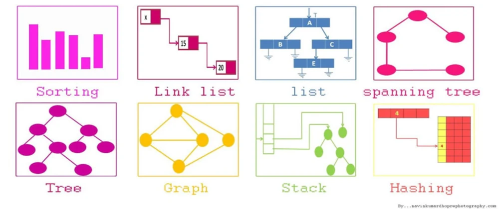

# Abstract_data

 
Post-CommonCore project of the 42 school. 

# Description

In this project, we must reimplement the following STL containers:
- sequence containers:
  - `list`
  - `deque`
  - `vector` (`bool` specialization is not required)
- associative containers:
  - `map`
  - `set`
  - `multimap`
  - `multiset`
- container adaptors:
  - `stack`
  - `queue`
  - `priority_queue`

If a container has an iterator system,  
we must reimplement it as well.

We must take the 1998 ISO C++ standard as reference.  
Complexities must be repected.
